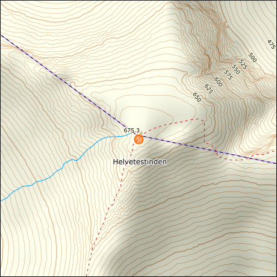

# dstien's userscripts

## iitc-map-no-kartverket-mod.user.js
**[IITC](https://iitc.app/) Plugin: Kartverket Norway maps (modified)**

Baselayer tiles for topographical maps and nautical chart from [Kartverket](https://www.kartverket.no/), the Norwegian Mapping Authority. Based on mainline IITC plugin with some QoL improvements.

## ingress-mission-ext.user.js
**Ingress Mission Authoring Tool extensions**

Add Intel and scanner links to portals in the [Ingress Mission Authoring Tool](https://missions.ingress.com/).

